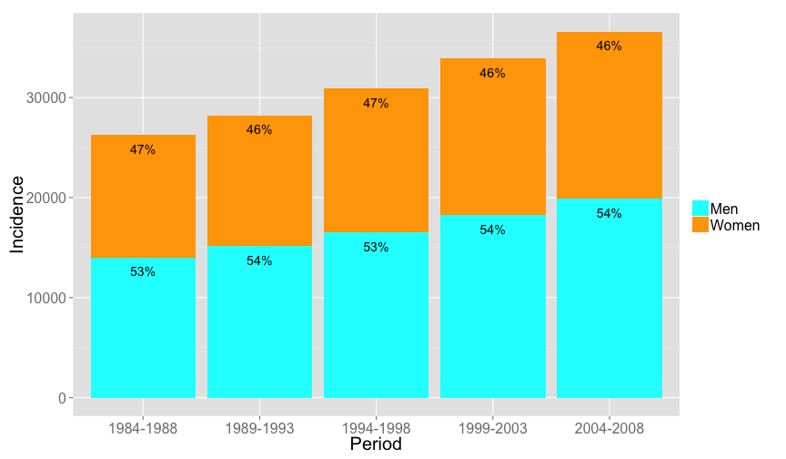

# Cancer in Switzerland from 1984 to 2008


### Course project of the coursera class "[Developing Data Products](https://class.coursera.org/devdataprod-006)"

Incidence number and average annual rate per 100 000 persons

Visualized with [Shiny](http://shiny.rstudio.com/): https://ijon.shinyapps.io/shiny/

---

## Displays development of cancer frequencies from 1984 to 2008

* displays either
  * cancer incidence **number**:  
    absolute number within given period (e.g. 1984 to 1988)
  * cancer indicence **rate**:  
    average annual number of new cancer cases per 100 000 persons in a given period
* select type of cancer, for example: 
  * Liver
  * Eye
  * or total number, summarized over all types of cancer
* select sex: display results
  * only for women
  * only for men
  * or for both

Results are displayed as a stacked bar graph:  
one bar for each 5-year period between 1984 and 2008.

--- .class #id

## Data source: Cancer epidemiology of the Swiss Federal Statistical Office

* [Cancer epidemiology of the Swiss Federal Statistical Office](http://www.bfs.admin.ch/bfs/portal/en/index/infothek/erhebungen__quellen/blank/blank/kbs/01.html)
* Get the data [here](http://www.pxweb.bfs.admin.ch/dialog/varval.asp?ma=px-d-14-2B11&ti=Krebs%3A+Anzahl+und+j%E4hrliche+Rate+der+Neuerkrankungen+und+Todesf%E4lle+nach+Altersgruppe%2C+Geschlecht%2C+Region+und+Krebslokalisation%2C+1984%2D2008&path=../Database/German_14%20-%20Gesundheit/14.2%20-%20Gesundheit%20der%20Bev%F6lkerung/&search=KREBS&lang=1)


--- .class #id 

## Server side calculations: 
   
Preparation: **load, clean, calculate percentage**   
For each page reload: **select rows, and display with ggplot2**

### Data preparation

* load the data from a csv file
* remove rows with no data
* change empty cells of sex-specific cancer types (e.g. Testicle cancer for women) from NA to 0
* Calculate percentage of men and women for a given cancer type using package ```ddplyr```.


### Calculation during each page reload

* select correct rows (depending on cancer type, sex)
* display correct variables: either incidence *number* or incidence *rate*
* create a ggplot2 plot with correct axis, titles (see next slide)

--- .class #id 

## Result

Say the user chose: *Display incidence of all types of cancers for both men and women*:


```r
input <- list(sex="both", cancer="All cancers")  # simulate Shiny input parameter
ggplot(data=select.data(input), aes(x=Period, y=Incidence.num, fill=Sex, label=Inc.num.perc, ymax=40000)) + 
  scale_fill_manual(values=colors) +  ylab("Incidence") +
  theme(axis.title=element_text(size=20), axis.text=element_text(size=16), legend.title=element_text(size=20),
    legend.text=element_text(size=16)) +
  guides(fill=guide_legend(title=NULL)) + geom_bar(stat="identity") + geom_text(position="stack", vjust=2)
```

 
